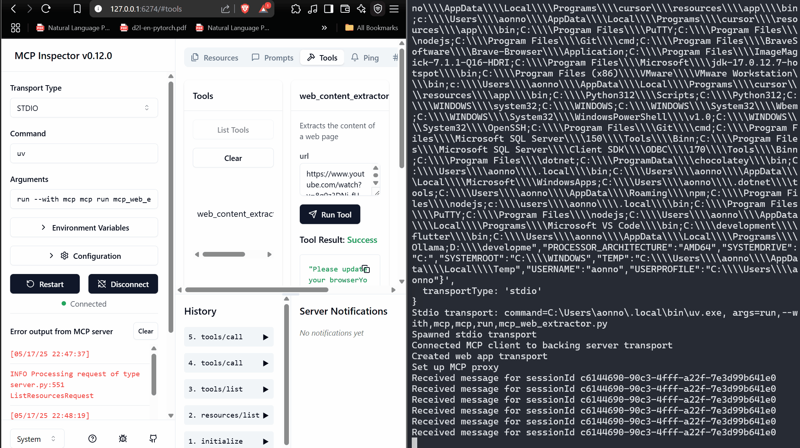

# Creating EXCEL MCP

## starting with basic MCP

https://www.youtube.com/watch?v=8g0z3DNi_fU

conda activate mcpenv

uv add mcp mcp[cli] httpx beautifulsoup4

(mcpenv) D:\codeplay\Excel-MCP>uv run mcp version
MCP version 1.9.0

It runs

# installing MCP on Visual Studio

https://www.youtube.com/watch?v=iS25RFups4A

https://www.youtube.com/watch?v=-8k9lGpGQ6g

